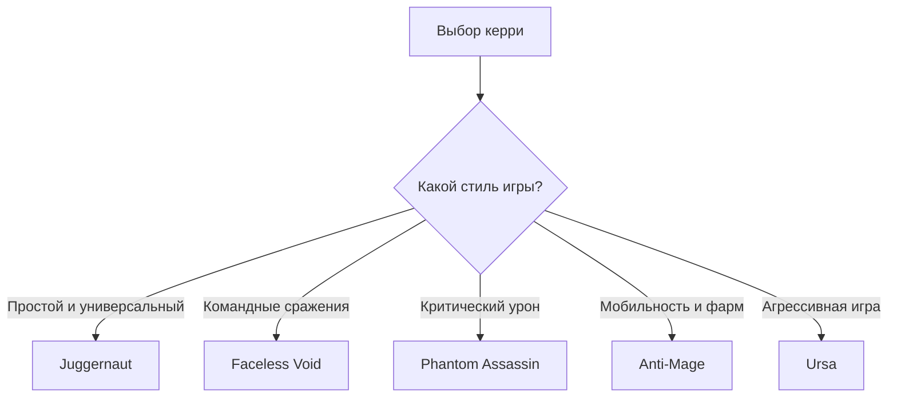

# 🎮 Лучшие керри-герои в Dota 2

> **Dota 2** — командная MOBA, в которой керри постепенно набирает силу за счёт опыта, золота и правильно подобранных предметов.

## 📚 Навигация

- [🏆 Топ-5 керри](#-топ-5-керри)
- [📊 Сравнение героев](#-сравнение-героев)
- [🔥 Почему эти герои сильные](#-почему-эти-герои-сильные)
- [🎯 Как выбрать керри](#-как-выбрать-керри)
- [💻 Пример кода](#-пример-кода)
- [📈 Схема выбора героя](#-схема-выбора-героя)
- [✅ Список задач](#-список-задач)

---

## 🏆 Топ-5 керри

### 1. 🗡️ Juggernaut


**Juggernaut** — универсальный керри, который хорошо чувствует себя на линии и может самостоятельно участвовать в сражениях.

- **Сильные стороны:** высокий урон, мобильность, лечение команды.
- **Главные способности:** Blade Fury, Healing Ward, Omnislash.
- **Сложность:** ⭐⭐☆☆☆
- **Лучше всего подходит:** новичкам и игрокам среднего уровня.

> **Совет:** используйте Blade Fury для защиты от магического урона и поиска выгодного момента для атаки.

---

### 2. ⏳ Faceless Void


**Faceless Void** — один из самых сильных героев для поздней стадии игры. Его главная сила заключается в возможности полностью изменить командный бой с помощью **Chronosphere**.

- **Сильные стороны:** высокий потенциал в late game, мобильность, сильный контроль.
- **Главная способность:** Chronosphere.
- **Сложность:** ⭐⭐⭐☆☆
- **Лучше всего подходит:** игрокам, которые умеют выбирать момент для начала драки.

---

### 3. 🗡️ Phantom Assassin


**Phantom Assassin** специализируется на огромном физическом уроне и критических ударах.

- **Сильные стороны:** критический урон, мобильность, быстрое уничтожение одиночных целей.
- **Главные способности:** Stifling Dagger, Phantom Strike, Coup de Grace.
- **Сложность:** ⭐⭐☆☆☆
- **Лучше всего подходит:** игрокам, которым нравится агрессивный стиль.

**Особенно опасна в тот момент, когда получает ключевые предметы и начинает быстро уничтожать саппортов и тонких героев.**

---

### 4. 🛡️ Anti-Mage


**Anti-Mage** — мобильный керри, который быстро фармит и отлично использует свободное пространство на карте.

- **Сильные стороны:** мобильность, быстрый фарм, высокий потенциал в late game.
- **Главные способности:** Blink, Counterspell, Mana Void.
- **Сложность:** ⭐⭐⭐⭐☆
- **Лучше всего подходит:** игрокам, которые хорошо понимают макроигру и распределение ресурсов.

---

### 5. 🐻 Ursa

**Ursa** — сильный герой для ранних и средних драк. Он способен быстро уничтожать одиночные цели благодаря большому физическому урону.

- **Сильные стороны:** сильный 1v1, Roshan, высокий burst-урон.
- **Главные способности:** Fury Swipes, Overpower, Enrage.
- **Сложность:** ⭐⭐⭐☆☆
- **Лучше всего подходит:** игрокам, которые любят активную игру.

---

## 📊 Сравнение героев

| Герой | Урон | Мобильность | Late Game | Сложность |
|---|:---:|:---:|:---:|:---:|
| **Juggernaut** | ⭐⭐⭐⭐ | ⭐⭐⭐⭐ | ⭐⭐⭐⭐ | ⭐⭐ |
| **Faceless Void** | ⭐⭐⭐⭐⭐ | ⭐⭐⭐⭐ | ⭐⭐⭐⭐⭐ | ⭐⭐⭐ |
| **Phantom Assassin** | ⭐⭐⭐⭐⭐ | ⭐⭐⭐⭐ | ⭐⭐⭐⭐⭐ | ⭐⭐ |
| **Anti-Mage** | ⭐⭐⭐⭐ | ⭐⭐⭐⭐⭐ | ⭐⭐⭐⭐⭐ | ⭐⭐⭐⭐ |
| **Ursa** | ⭐⭐⭐⭐⭐ | ⭐⭐⭐ | ⭐⭐⭐⭐ | ⭐⭐⭐ |

### 📌 Критерии оценки

1. **Урон** — насколько быстро герой способен уничтожать противников.
2. **Мобильность** — возможность быстро входить в бой и выходить из него.
3. **Late Game** — насколько хорошо герой масштабируется с предметами и уровнями.
4. **Сложность** — количество игровых навыков, необходимых для эффективной игры.

---

## 🔥 Почему эти герои сильные

Керри обычно становится значительно сильнее по мере получения **золота, опыта и предметов**. В отличие от многих других ролей, его основная задача — максимально эффективно использовать ресурсы команды и превращать преимущество в победу.

### Основные преимущества сильного керри

- высокий физический урон;
- хорошее масштабирование в поздней игре;
- возможность быстро фармить;
- способность уничтожать ключевых героев противника;
- возможность самостоятельно закончить игру при большом преимуществе.

---

## 🎯 Как выбрать керри

Выбор героя зависит от стиля игры:

- Если хочется **простого и универсального героя** → **Juggernaut**.
- Если нравится **контроль командных сражений** → **Faceless Void**.
- Если хочется **огромных критических ударов** → **Phantom Assassin**.
- Если нравится **быстрый фарм и мобильность** → **Anti-Mage**.
- Если хочется **агрессивно драться с первых минут** → **Ursa**.

### 🌐 Полезные ссылки

- [Официальный сайт Dota 2](https://www.dota2.com/)
- [Dota 2 Wiki — роли героев](https://dota2.fandom.com/wiki/Role)
- [Dota 2 Wiki — список героев](https://dota2.fandom.com/wiki/Heroes)
- [Страница Faceless Void](https://dota2.fandom.com/wiki/Faceless_Void)
- [Страница Phantom Assassin](https://dota2.fandom.com/wiki/Phantom_Assassin)
- [Страница Juggernaut](https://dota2.fandom.com/wiki/Juggernaut)

---

## 📝 О проекте

Этот **README.md** посвящён сравнению популярных керри-героев Dota 2.

**Главная идея:** показать, чем отличаются разные типы керри и в каких ситуациях каждый герой раскрывается лучше всего.

`Dota 2` требует не только хорошей реакции, но и **понимания карты, экономики и командного взаимодействия**.

---

## 💬 Цитата

> «Хороший керри — это не тот, кто просто наносит много урона, а тот, кто умеет превратить полученное преимущество в победу.»

---

## 📂 Структура проекта

```text
dota2-carries/
├── README.md
├── src/
│   └── carry_example.java
├── translations/
│   └── heroes_en.md
└── resources/
    └── sources.md
```

### Документы проекта

1. [Пример Java-кода](src/carry_example.java)
2. [Названия героев на английском](translations/heroes_en.md)
3. [Источники и материалы](resources/sources.md)

---

## 💻 Пример кода

Ниже приведён небольшой пример на **Java**, который выбирает героя с наибольшим рейтингом:

```java
public class CarryExample {

    static class Hero {
        String name;
        int rating;

        Hero(String name, int rating) {
            this.name = name;
            this.rating = rating;
        }
    }

    public static void main(String[] args) {
        Hero[] heroes = {
            new Hero("Juggernaut", 8),
            new Hero("Faceless Void", 10),
            new Hero("Phantom Assassin", 9),
            new Hero("Anti-Mage", 9),
            new Hero("Ursa", 8)
        };

        Hero best = heroes[0];

        for (Hero hero : heroes) {
            if (hero.rating > best.rating) {
                best = hero;
            }
        }

        System.out.println("Лучший керри: " + best.name);
    }
}
```

---

## 📈 Схема выбора героя



---

## 📌 Итоговый рейтинг

**Топ-5 для проекта:**

1. 🥇 **Faceless Void** — максимальный потенциал в командных сражениях и late game.
2. 🥈 **Phantom Assassin** — огромный физический урон и критические удары.
3. 🥉 **Anti-Mage** — высокая мобильность и сильный late game.
4. **Juggernaut** — универсальность и простота освоения.
5. **Ursa** — сильная агрессия и отличные возможности для убийства одиночных целей.

> ⚠️ Рейтинг является учебной оценкой, а не абсолютным показателем силы героев: эффективность керри зависит от версии игры, состава команд, предметов и навыков игрока.

---

## ✅ Список задач

- [x] Выбрать тему проекта
- [x] Добавить несколько заголовков
- [x] Добавить навигацию по документу
- [x] Добавить внутренние и внешние ссылки
- [x] Добавить изображения
- [x] Добавить описание проекта
- [x] Использовать разные способы выделения текста
- [x] Добавить цитату
- [x] Добавить горизонтальные разделители
- [x] Добавить маркированные списки
- [x] Добавить нумерованные списки
- [x] Добавить пример Java-кода
- [x] Добавить Mermaid-диаграмму
- [x] Добавить ссылки на документы проекта
- [x] Добавить таблицу сравнения героев

---

### ⭐ Спасибо за просмотр!

**GG WP! 🏆**
