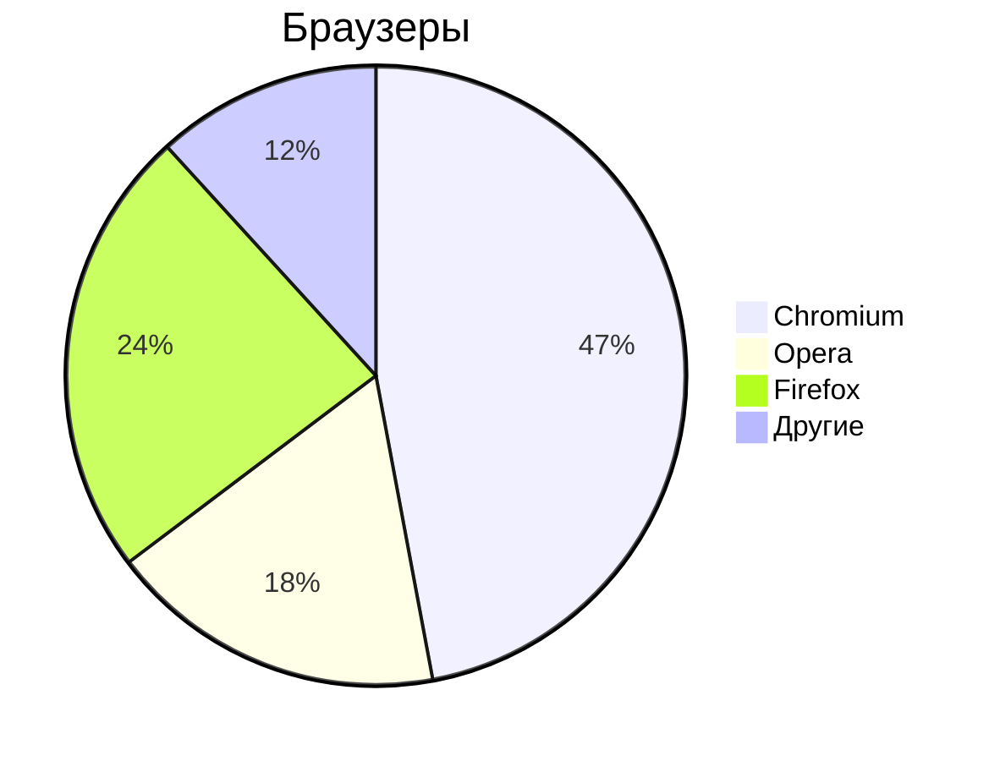

# Markdown

**Markdown** - простое форматирование документа, пригодное для Git-репозитория, документации, заметок.

## Основы редактирования текста по горячим клавишам

## Курсор

Клавиши

- `Home` - курсор в начало строки
- `END` - курсор в конец строки
- `pgUP` - курсор вверх видимой части документа
- `pgDOWN` - курсор вниз видимой части документа

### Выделение текста

- `Ctrl+A` - выделить весь текст
- `Ctrl+>` - выделить символ справа от курсора
- `Ctrl+<` - выделить символ слева от курсора
- `Ctrl+S` -  сохранить документ
- `Ctrl+C` - копировать выделенное
- `Ctrl+V` - вставить выделенное
- `Shift+>` - посимвольное выделение вправо
- `Shift+<` - посимвольное выделение влево
- `Ctrl+Shift+>` - пословное выделение текста вправо
- `Ctrl+SHift+<` - пословное выделение текста влево

### Копирование/Вставка

- `Ctrl+Shift+С` - копировать выделенное в терминале
- `Ctrl+Shift+V` - вставить выделенное в терминале

### TEXT EDITOR
### Редактирование текста

- `Del` - удалить символ справа от курсора
- `Backspace` - удалить символ слева от курсора
- `Ins/Insert` - замещение старого текста новым справа от курсора
- `Ctrl+>` - перемещение по словам вправо
- `Ctrl+<` - перемещение по слова влево

---

## Markdown

Заголовки

# - Заголовок 1-го уровня
## -Заголовок 2-го уровня
### - Заголовок 3-го уровня
#### - Заголовок 4-го уровня

Текст

- **Жирный текст**
- *Курсив*
- ~~Зачеркнутый текста~~
- <u>Подчеркнутый текст </u>


---

***

Списки

Ненумерованный

- Пункт 1
- Пункт 2

* Пункт 1
* Пункт 2
    - Пункт 1
    - Пункт 2

Нумерованный
1. Пункт 1
2. Пункт 2
3. Пункт 3
4. Пункт 4
5. Пункт 5


Ссылки

Внутренние ссылки

[Текст ссылки](/content/Mermaid/readme.md)

Якоря по документу

- [Редактирование] (#text-editor)


Внешние ссылки

- [ОЗОН](https://ozon.ru)

Изображения


Код

- `Ctrl+R` - обновить страницу браузера
- `F5` - обновить страницу браузера

```python
print("Hello")
```
```cpp
int main() {
    pust("Hello)
}
```


Цитаты

>Тут важный текст

Таблицы

| Заголовок 1 | Заголовок 2 | Заголовок 3|
|-------------|-------------|------------|
| Ячейка 1    | Ячейка 2    | Ячейка 3   |
| Ячейка 4    | Ячейка 4    | Ячейка 5   |


Список задач

- [x] - задача
